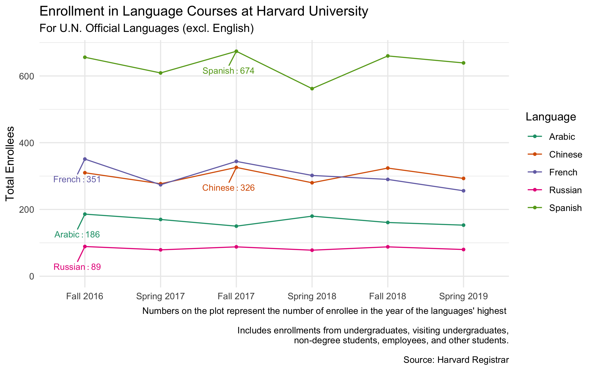

# Course Enrollments at Harvard College
## Introduction

What courses do Harvard students take? What are the enrollment trend across years? What languages are most popular among Harvard students. This project in R aims to explore the enrollment dataset published by Harvard's Registrar.

**Enrollment in Language Courses Across Time, Fall 2016 - Spring 2019**

Access the result of this visualization on [my RPubs page](http://rpubs.com/ruoqi_zhang/language-enrollment).

Using `tidyverse` and `ggplot`, I created a plot that demonstrates the variation of language course enrollments across years, specifying, for each language, the year with highest enrollment.

`language_enrollment.Rmd` is the R Markdown file used to explore the data. You can see the detailed, annonated code that created the plot.
`language_enrollment.html` is the html file generated by the R Markdown file. Access it [here](http://rpubs.com/ruoqi_zhang/language-enrollment).

**Comparing Course Enrollment Data Between Spring 2018 and Spring 2019**

Access the result of this visualization on [my RPubs page](http://rpubs.com/ruoqi_zhang/spring_enrollment_comparison).

Using `tidyverse` and `gt`, I created two tables that show (1) the 10 largest course enrollment decreases across semesters, and (2) the largest course newly offered in Spring 2019. 

`spring_enrollment.Rmd` is the R Markdown file used to explore the data. You can see the detailed code that created the tables.
`spring_enrollment.html` is the html file generated by the R Markdown file. Access it [here](http://rpubs.com/ruoqi_zhang/spring_enrollment_comparison).

## Visualization

## Data

The Registrar of Harvard's Faculty of Arts and Sciences [publishes](https://registrar.fas.harvard.edu/faculty-staff/courses/enrollment) semesterly enrollment data in all courses offered by the division. For archived enrollment data dating back to 2000, see [this link](https://registrar.fas.harvard.edu/faculty-staff/courses/enrollment/archived-course-enrollment-reports).

This repository contains the published enrollment data from Fall 2016 to Spring 2019. They are stored in `enrollment_data` directory, in xlsx format. Note that Harvard FAS Registrar occassionally updates the enrollment data of the current semester.

